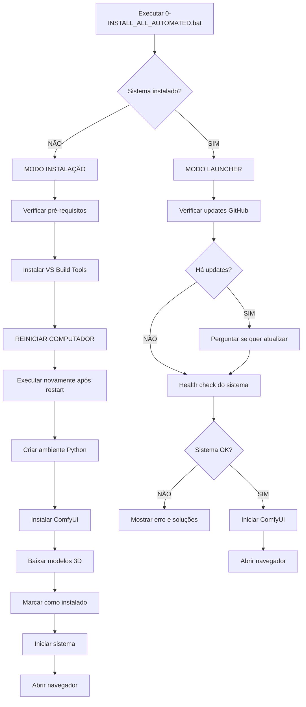

# AIEXX - Guia Rápido de Lançamento

## 🚀 Início Rápido em 30 Segundos

### Primeira Vez (Instalação)
```batch
# Execute como Administrador:
0-INSTALL_ALL_AUTOMATED.bat
```
Aguarde a instalação completa (~30-60 min). O sistema iniciará automaticamente ao final.

### Próximas Vezes (Launcher)
```batch
# Apenas clique duas vezes:
0-INSTALL_ALL_AUTOMATED.bat
```
O sistema:
- ✅ Verifica updates do GitHub
- ✅ Faz health check
- ✅ Inicia ComfyUI
- ✅ Abre o navegador automaticamente em http://localhost:8188

---

## 📊 Fluxo do Smart Launcher



---

## 🎮 Modo Launcher - Recursos

### 1. Auto-Update do GitHub

Se o projeto está em repositório git, o launcher:

```
[INFO] Git repository detected
[INFO] Checking for updates from GitHub...

[UPDATE] 3 new update(s) available!

Do you want to update now? (Y/N)
```

Se você escolher **Y**:
- Faz `git pull origin main`
- Atualiza pacotes Python (`pip install -r requirements.txt --upgrade`)
- Continua com a inicialização

### 2. System Health Check

Antes de iniciar, verifica:

```
============================================================
|              System Health Check...                    |
============================================================

[1/4] Checking virtual environment...
[OK] Virtual environment found

[2/4] Checking ComfyUI installation...
[OK] ComfyUI found

[3/4] Checking GPU availability...
[OK] CUDA available

[4/4] Checking 3D models...
[OK] Essential models found (3/3)
```

Se algum componente crítico estiver faltando:
```
[ERROR] Virtual environment missing!

Critical components are missing!

Options:
1. Delete .aiexx_installed and run this script again
2. Run installation scripts manually
```

### 3. Auto-Start com Navegador

Após health check:

```
============================================================
|              Starting ComfyUI Server...                |
============================================================

Server will start at: http://localhost:8188
Opening browser automatically in 5 seconds...

[INFO] Launching ComfyUI...
[INFO] Waiting for server to start...
[INFO] Opening browser...

============================================================
|              AIEXX System Running!                     |
============================================================

ComfyUI is now running at: http://localhost:8188

Press any key to close this launcher (server keeps running)
```

---

## 💡 Dicas de Uso

### Como Usar Diariamente

1. **Iniciar o Sistema:**
   ```batch
   # Duplo clique em:
   0-INSTALL_ALL_AUTOMATED.bat
   ```

2. **Aguardar o navegador abrir** (automático em 5 segundos)

3. **Carregar um workflow:**
   - No ComfyUI, clique em "Load"
   - Navegue para `workflows/3d/`
   - Selecione: `03_triposr_single_image_to_mesh.json`

4. **Gerar modelo 3D:**
   - Upload uma imagem
   - Clique "Queue Prompt"
   - Aguarde ~30 segundos
   - Baixe o arquivo `.glb` da pasta `output/`

### Fechar o Sistema

Para encerrar o ComfyUI:
- Feche a janela "ComfyUI Server" que aparece minimizada
- Ou pressione Ctrl+C na janela do servidor

O launcher principal pode ser fechado sem afetar o servidor.

---

## 🔧 Solução de Problemas

### Launcher abre e fecha imediatamente

**Causa:** Erro no script ou falta de permissões

**Solução:**
1. Clique com botão direito em `0-INSTALL_ALL_AUTOMATED.bat`
2. Selecione "Executar como Administrador"
3. Se persistir, abra o CMD como Admin e execute manualmente

### Sistema não abre o navegador

**Causa:** Servidor demora mais para iniciar ou porta ocupada

**Solução:**
1. Aguarde 10-15 segundos
2. Abra manualmente: http://localhost:8188
3. Se não funcionar, verifique se a porta 8188 está livre

### Health check falha

**Causa:** Componentes foram movidos ou deletados

**Solução 1 - Reinstalar:**
```batch
# Deletar marcador de instalação
del .aiexx_installed

# Executar novamente
0-INSTALL_ALL_AUTOMATED.bat
```

**Solução 2 - Manual:**
Execute os scripts de instalação individualmente:
```batch
2-FIX_VENV_AND_INSTALL_TORCH_SCATTER.bat
3-RUN_INSTALL_3DPACK.bat
4-DOWNLOAD_3D_MODELS.bat
```

### Updates do GitHub falhando

**Causa:** Mudanças locais conflitando

**Solução:**
```batch
# Desfazer mudanças locais
git reset --hard HEAD

# Executar launcher novamente
0-INSTALL_ALL_AUTOMATED.bat
```

---

## 📂 Arquivos do Sistema

### Arquivos Marcadores

- **`.aiexx_installed`** - Indica que sistema foi instalado
  - Criado ao completar instalação
  - Se deletar, volta ao modo instalação

- **`.aiexx_install_checkpoint`** - Checkpoint de instalação
  - Usado durante instalação
  - Deletado ao finalizar
  - Permite retomar após restart

### Estrutura após Instalação

```
C:\AIEXX_GENAI_IMAGE_TO_3D\
├── 0-INSTALL_ALL_AUTOMATED.bat  ← ARQUIVO PRINCIPAL
├── .aiexx_installed              ← Marcador de instalação
├── .venv311\                     ← Ambiente Python
├── ComfyUI\                      ← ComfyUI instalado
│   ├── main.py
│   ├── models\
│   │   ├── triposr\
│   │   ├── instantmesh\
│   │   └── zero123\
│   └── output\                   ← Seus modelos 3D gerados
└── workflows\
    └── 3d\                       ← Workflows prontos
```

---

## ⚡ Comparação: Launcher vs Scripts Manuais

| Ação | Smart Launcher | Scripts Manuais |
|------|---------------|-----------------|
| **Instalar pela primeira vez** | 1 comando | 6 comandos |
| **Iniciar o sistema** | 1 clique | 1 clique |
| **Verificar updates** | Automático | Manual (git pull) |
| **Abrir navegador** | Automático | Manual |
| **Health check** | Automático | Não tem |
| **Retomar após restart** | Automático | Manual |
| **Ideal para** | Todos os usuários | Dev/Debug |

---

## 🎯 Casos de Uso

### Uso Diário Normal
```batch
# Apenas executar:
0-INSTALL_ALL_AUTOMATED.bat

# Aguardar navegador abrir
# Começar a gerar modelos 3D!
```

### Desenvolvimento/Testes
```batch
# Se fez mudanças no código e quer testar:
0-INSTALL_ALL_AUTOMATED.bat

# Vai oferecer atualizar do GitHub
# Escolha "N" para manter suas mudanças locais
```

### Máquina Nova
```batch
# Primeira execução em nova máquina:
0-INSTALL_ALL_AUTOMATED.bat

# Vai instalar tudo do zero
# Após restart, execute novamente
# Sistema pronto para usar!
```

### Após Update do Projeto
```batch
# Execute o launcher:
0-INSTALL_ALL_AUTOMATED.bat

# Vai detectar updates:
[UPDATE] 5 new update(s) available!
Do you want to update now? (Y/N)

# Escolha Y
# Updates aplicados automaticamente
# Sistema inicia com nova versão
```

---

## 📞 Suporte

- **Documentação Completa:** [INSTALACAO_AUTOMATIZADA.md](INSTALACAO_AUTOMATIZADA.md)
- **Solução de Problemas:** [TROUBLESHOOTING_BATCH_FILES.md](TROUBLESHOOTING_BATCH_FILES.md)
- **Guia de Uso:** [COMO_USAR.md](COMO_USAR.md)

---

**Versão:** 1.1.0
**Última Atualização:** 2025-11-01
