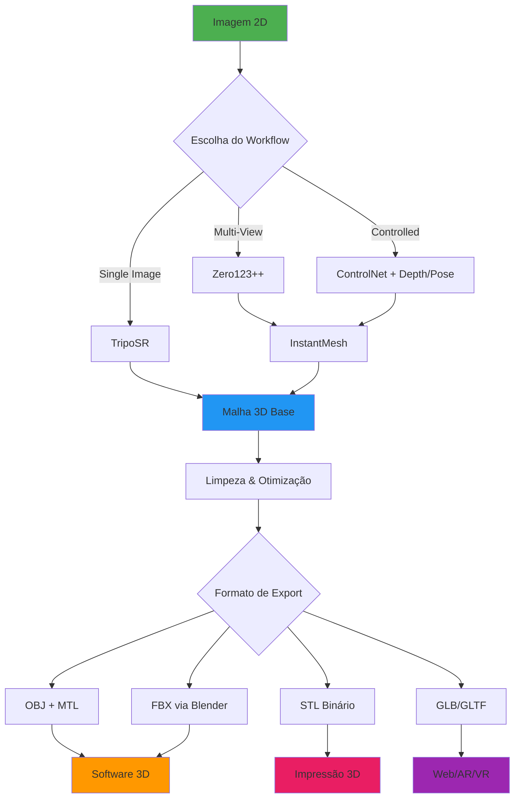
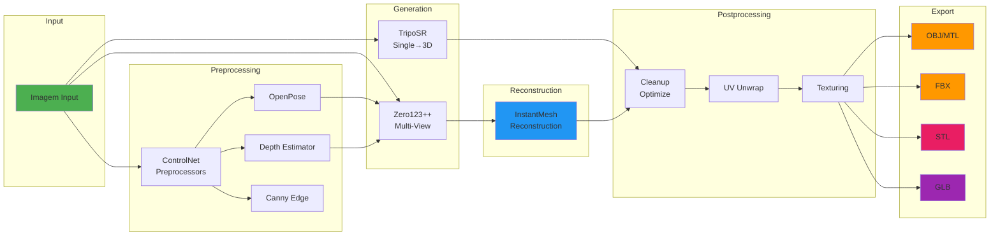

<div align="center">

# 🎨 AIEXX GenAI Image to 3D

### Pipeline Completo para Conversão de Imagens 2D em Malhas 3D

[](https://github.com/AIExxplorer/AIEXX_GENAI_IMAGE_TO_3D/releases)
[](https://opensource.org/licenses/MIT)
[](https://www.python.org/downloads/)
[](https://github.com/comfyanonymous/ComfyUI)
[](https://huggingface.co/)
[](https://conventionalcommits.org)
[](https://github.com/AIExxplorer/AIEXX_GENAI_IMAGE_TO_3D)

---

**[Documentação](#documentação)** • **[Instalação](#instalação)** • **[Uso](#uso)** • **[Workflows](#workflows)** • **[Exportação](#exportação)** • **[Contribuindo](#contribuindo)**

</div>

---

## 📋 Índice

- [Sobre o Projeto](#sobre-o-projeto)
- [Tecnologias](#tecnologias)
- [Arquitetura](#arquitetura)
- [Requisitos](#requisitos)
- [Instalação](#instalação)
- [Configuração](#configuração)
- [Workflows Disponíveis](#workflows-disponíveis)
- [Formatos de Exportação](#formatos-de-exportação)
- [Compatibilidade de Software](#compatibilidade-de-software)
- [Estrutura do Projeto](#estrutura-do-projeto)
- [Contribuindo](#contribuindo)
- [Licença](#licença)

---

## 🎯 Sobre o Projeto

O **AIEXX GenAI Image to 3D** é um pipeline avançado baseado em **ComfyUI** que utiliza modelos de inteligência artificial de última geração para converter imagens 2D em malhas 3D completas e prontas para uso profissional.

### ✨ Principais Características

- 🔄 **4 Workflows Especializados** para diferentes casos de uso
- 🎨 **Múltiplos Modelos de IA**: Zero123++, TripoSR, InstantMesh, ControlNet
- 📦 **Exportação Multi-Formato**: OBJ, FBX, STL, GLB
- 🎯 **Controle Avançado**: Pose (OpenPose), Profundidade (Depth), Canny, Tile
- 🔧 **Pipeline Automatizado**: De imagem até malha finalizada
- 💼 **Produção Profissional**: Compatível com Maya, ZBrush, Blender, Element3D
- 🚀 **GPU Otimizado**: DirectML (AMD/Intel) e CUDA (NVIDIA)

---

## 🛠️ Tecnologias

### Modelos de IA

| Modelo | Função | Formato |
|--------|--------|---------|
| **Zero123 / Zero123++** | Geração de múltiplas vistas | `.safetensors`, `.ckpt`, `.pt`, `.pth` |
| **TripoSR** | Reconstrução 3D de imagem única | `.safetensors`, `.ckpt`, `.pt`, `.pth`, `.onnx` |
| **InstantMesh** | Reconstrução 3D multi-view | `.safetensors`, `.ckpt`, `.pt`, `.pth` |
| **ControlNet SD1.5** | Controle por pose/depth/canny/tile | `.safetensors`, `.pth` |

### Stack Tecnológico



### Pipeline de Processamento



---

## 📦 Requisitos

### Sistema Operacional
- ✅ **Windows 10/11** (testado e otimizado)
- ✅ **Linux** (compatível)
- ✅ **macOS** (compatível, sem DirectML)

### Hardware
- **GPU**: NVIDIA (CUDA), AMD (DirectML), Intel (DirectML)
- **RAM**: Mínimo 16GB, Recomendado 32GB+
- **Armazenamento**: ~50GB para modelos + exports

### Software
- **Python**: 3.11.x
- **Node.js**: 18.x ou superior (para Husky/commitlint)
- **Git**: 2.x ou superior
- **Blender**: 3.x ou superior (para exportação FBX)
- **ComfyUI**: Última versão estável

---

## 🚀 Instalação

### Guia Rápido

Para instalação completa passo a passo, consulte:
- **[QUICKSTART.md](QUICKSTART.md)** - Guia de início rápido (30 minutos)
- **[CHECKLIST.md](CHECKLIST.md)** - Checklist completo de verificação

### 1. Configure o Token Hugging Face

```powershell
# Windows PowerShell
.\setup_env.ps1 -HF_TOKEN "seu_token_aqui"
```

### 2. Crie a Estrutura de Diretórios

```powershell
.\create_directories.ps1
```

### 3. Baixe os Modelos

```powershell
# Baixar todos os modelos (~30-60 min)
.\download_models.ps1

# OU baixar modelos específicos
.\download_models.ps1 -Models controlnet,triposr
```

### 4. Verifique a Instalação

```powershell
# Verificar status geral
.\monitor_status.ps1

# Verificar modelos instalados
.\monitor_status.ps1 -Models

# Acompanhar downloads em tempo real
.\monitor_status.ps1 -Live
```

### 5. Configure o ComfyUI

```bash
# Instalar ComfyUI custom nodes necessários
cd ComfyUI/custom_nodes

# ComfyUI-3D-Pack (TripoSR, InstantMesh)
git clone https://github.com/MrForExample/ComfyUI-3D-Pack
cd ComfyUI-3D-Pack && pip install -r requirements.txt && cd ..

# ComfyUI Manager (recomendado)
git clone https://github.com/ltdrdata/ComfyUI-Manager

# ComfyUI ControlNet Aux
git clone https://github.com/Fannovel16/comfyui_controlnet_aux
cd comfyui_controlnet_aux && pip install -r requirements.txt && cd ..
```

---

## 📚 Documentação

O projeto inclui documentação completa para facilitar o uso:

| Documento | Descrição |
|-----------|-----------|
| **[README.md](README.md)** | Este arquivo - Visão geral do projeto |
| **[QUICKSTART.md](QUICKSTART.md)** | Guia de início rápido em 30 minutos |
| **[CHECKLIST.md](CHECKLIST.md)** | Checklist completo de verificação e troubleshooting |
| **[workflows/3d/README.md](workflows/3d/README.md)** | Documentação detalhada de workflows, parâmetros e exportação |

### Scripts Disponíveis

| Script | Função |
|--------|--------|
| `setup_env.ps1` | Configurar token Hugging Face |
| `create_directories.ps1` | Criar estrutura de diretórios |
| `download_models.ps1` | Baixar modelos do Hugging Face |
| `monitor_status.ps1` | Monitorar status e verificar modelos |
| `tools/blender_export_fbx.py` | Conversão OBJ → FBX via Blender |

---

## ⚙️ Configuração

### Configuração Simplificada

Use os scripts PowerShell fornecidos:

```powershell
# 1. Configurar token (obter em https://huggingface.co/settings/tokens)
.\setup_env.ps1 -HF_TOKEN "seu_token_aqui"

# 2. Criar estrutura
.\create_directories.ps1

# 3. Baixar modelos
.\download_models.ps1

# 4. Verificar instalação
.\monitor_status.ps1 -Models
```

### Modelos Necessários

Os seguintes modelos serão baixados automaticamente pelo script `download_models.ps1`:

| Modelo | Repositório | Arquivos | Status |
|--------|-------------|----------|--------|
| **ControlNet SD1.5** | [lllyasviel/ControlNet-v1-1](https://huggingface.co/lllyasviel/ControlNet-v1-1) | 4 arquivos .pth (~5.8 GB) | ✅ |
| **Zero123** | [cvlab/zero123-weights](https://huggingface.co/cvlab/zero123-weights) | 105000.ckpt (~4.5 GB) | ✅ |
| **Zero123++ v1.2** | [sudo-ai/zero123plus-v1.2](https://huggingface.co/sudo-ai/zero123plus-v1.2) | 4 componentes (~3.5 GB) | ✅ |
| **TripoSR** | [stabilityai/TripoSR](https://huggingface.co/stabilityai/TripoSR) | model.ckpt + config (~1.7 GB) | ✅ |
| **InstantMesh** | [TencentARC/InstantMesh](https://huggingface.co/TencentARC/InstantMesh) | instant_mesh_large.ckpt (~5 GB) | ✅ |

**Total**: ~20 GB | **12 arquivos baixados** ✅

> **Nota**: O script de download (`download_models.py`) já foi corrigido e testado. Todos os modelos foram baixados com sucesso em 30/10/2025.

---

## 🔄 Workflows Disponíveis

### 1️⃣ Zero123 Multi-View Generation
**Arquivo:** `workflows/3d/01_zero123_multiview.json`

Gera múltiplas vistas de uma imagem única usando Zero123++.

**Input:**
- Imagem única (PNG, JPG)

**Output:**
- 8+ vistas da mesma cena

**Parâmetros:**
- Views: 8 (padrão)
- Seed: 12345
- Guidance: 3.5

---

### 2️⃣ Multi-View to Mesh (InstantMesh)
**Arquivo:** `workflows/3d/02_multiview_to_mesh_instantmesh.json`

Converte múltiplas vistas em malha 3D completa.

**Input:**
- Lista de imagens multi-view

**Output:**
- Malha 3D (OBJ, FBX, STL, GLB)

**Parâmetros:**
- Texture Resolution: 2048
- Clean Up: true

---

### 3️⃣ TripoSR Single Image to Mesh
**Arquivo:** `workflows/3d/03_triposr_single_image_to_mesh.json`

Reconstrução 3D direta de imagem única.

**Input:**
- Imagem única

**Output:**
- Malha 3D pronta

**Parâmetros:**
- Texture Resolution: 2048
- Scale Units: cm

---

### 4️⃣ Pose/Depth Guided Reconstruction
**Arquivo:** `workflows/3d/04_openpose_or_depth_guided_recon.json`

Reconstrução guiada por ControlNet (Pose ou Depth).

**Input:**
- Imagem + Control (OpenPose/Depth)

**Output:**
- Malha 3D guiada

**Parâmetros:**
- ControlNet: openpose / depth
- Guidance: 2.5

---

## 📤 Formatos de Exportação

### OBJ + MTL
- ✅ UV unwrapping
- ✅ Material definitions
- ✅ Compatível: Maya, ZBrush, Blender
- 📁 **Export:** `exports/obj/`

### FBX (via Blender)
- ✅ Smoothing groups
- ✅ Tangents
- ✅ FBX 2018/2019
- ✅ Compatível: Maya, 3ds Max, Element3D
- 📁 **Export:** `exports/fbx/`

**Uso:**
```bash
"<caminho_blender>\blender.exe" -b -P tools\blender_export_fbx.py -- "input.obj" "exports\fbx\output.fbx"
```

### STL
- ✅ Binário
- ✅ Watertight geometry
- ✅ Unidades: mm
- ✅ Compatível: Fatiadores 3D (Cura, PrusaSlicer)
- 📁 **Export:** `exports/stl/`

### GLB/GLTF
- ✅ Texturas embutidas
- ✅ PBR materials
- ✅ Draco compression (opcional)
- ✅ Compatível: Three.js, Unity, Unreal, Web AR/VR
- 📁 **Export:** `exports/glb/`

---

## 🎨 Compatibilidade de Software

| Software | OBJ | FBX | STL | GLB |
|----------|-----|-----|-----|-----|
| **Autodesk Maya** | ✅ | ✅ | ⚠️ | ⚠️ |
| **ZBrush** | ✅ | ✅ | ✅ | ❌ |
| **Blender** | ✅ | ✅ | ✅ | ✅ |
| **3ds Max** | ✅ | ✅ | ⚠️ | ⚠️ |
| **Cinema 4D** | ✅ | ✅ | ⚠️ | ⚠️ |
| **After Effects (Element3D)** | ✅ | ✅ | ❌ | ❌ |
| **Unity** | ✅ | ✅ | ❌ | ✅ |
| **Unreal Engine** | ✅ | ✅ | ❌ | ✅ |
| **Three.js / WebGL** | ✅ | ❌ | ❌ | ✅ |
| **Impressoras 3D** | ⚠️ | ❌ | ✅ | ⚠️ |

**Legenda:**
- ✅ Suporte completo
- ⚠️ Suporte parcial ou requer conversão
- ❌ Não suportado

---

## 📁 Estrutura do Projeto

```
AIEXX_GENAI_IMAGE_TO_3D/
│
├── ComfyUI/
│   ├── models/
│   │   ├── controlnet/          # Modelos ControlNet SD1.5
│   │   ├── zero123/             # Zero123 / Zero123++
│   │   ├── triposr/             # TripoSR
│   │   └── instantmesh/         # InstantMesh
│   ├── input/                   # Imagens de entrada
│   ├── output/                  # Outputs temporários
│   └── temp/                    # Arquivos temporários
│
├── workflows/
│   └── 3d/
│       ├── 01_zero123_multiview.json
│       ├── 02_multiview_to_mesh_instantmesh.json
│       ├── 03_triposr_single_image_to_mesh.json
│       ├── 04_openpose_or_depth_guided_recon.json
│       ├── 00_cleanup_optimize.README.txt
│       └── STATUS.txt           # Status de workflows
│
├── exports/
│   ├── obj/                     # Exportações OBJ + MTL
│   ├── fbx/                     # Exportações FBX
│   ├── stl/                     # Exportações STL
│   └── glb/                     # Exportações GLB/GLTF
│
├── tools/
│   └── blender_export_fbx.py    # Script conversão FBX
│
├── .husky/                      # Git hooks
│   └── commit-msg               # Validação Conventional Commits
│
├── .gitignore
├── commitlint.config.js
├── package.json
├── downloads_status.log         # Log de downloads
├── README.md
├── TODO.md                      # Tarefas pendentes
└── LICENSE

```

---

## 🤝 Contribuindo

Contribuições são bem-vindas! Seguimos o padrão **Conventional Commits**.

### Tipos de Commit

- `feat:` Nova funcionalidade
- `fix:` Correção de bug
- `docs:` Alterações na documentação
- `style:` Formatação de código
- `refactor:` Refatoração de código
- `perf:` Melhorias de performance
- `test:` Adição/correção de testes
- `build:` Mudanças em dependências
- `ci:` Mudanças em CI/CD
- `chore:` Outras mudanças

### Exemplo

```bash
git commit -m "feat: adiciona suporte para exportação USDZ"
git commit -m "fix: corrige orientação de normais no export FBX"
git commit -m "docs: atualiza README com novos workflows"
```

O **Husky** validará automaticamente seus commits antes do push! ✅

---

## 📊 Status do Projeto

**Versão Atual**: v0.1.0 (30 de Outubro de 2025)

### Progresso Geral: 45% 🟦🟦🟦🟦⬜⬜⬜⬜⬜⬜

| Componente | Status | Progresso |
|------------|--------|-----------|
| **Estrutura de Diretórios** | ✅ Completo | 100% |
| **Scripts de Automação** | ✅ Completo | 100% |
| **Download de Modelos** | ✅ Completo | 100% (12/12 arquivos) |
| **Documentação** | ✅ Completo | 100% |
| **Workflows ComfyUI** | 🟡 Em Progresso | 25% (templates criados) |
| **Testes e Validação** | ⏳ Pendente | 0% |
| **Integração Hugging Face** | 🟡 Configurado | 50% (aguardando Space) |

### Últimas Atualizações

- ✅ **v0.1.0** (30/10/2025): Setup inicial completo, todos os modelos baixados
- ✅ Correção de nomes de arquivos nos modelos (ControlNet, TripoSR, Zero123++, InstantMesh)
- ✅ 12 arquivos de modelos baixados com sucesso (~20 GB)
- ✅ Scripts PowerShell e Python testados e funcionais

Veja o arquivo **[TODO.md](TODO.md)** para uma lista completa de tarefas pendentes e em progresso.

---

## 📄 Licença

Este projeto está licenciado sob a **MIT License** - veja o arquivo [LICENSE](LICENSE) para detalhes.

---

## 🙏 Agradecimentos

- [ComfyUI](https://github.com/comfyanonymous/ComfyUI) - Framework base
- [Hugging Face](https://huggingface.co/) - Hospedagem de modelos
- [Stability AI](https://stability.ai/) - TripoSR
- [TencentARC](https://github.com/TencentARC) - InstantMesh, Zero123++
- [lllyasviel](https://github.com/lllyasviel) - ControlNet

---

<div align="center">

**Desenvolvido com ❤️ por AIEXX**

[⬆ Voltar ao topo](#-aiexx-genai-image-to-3d)

</div>

