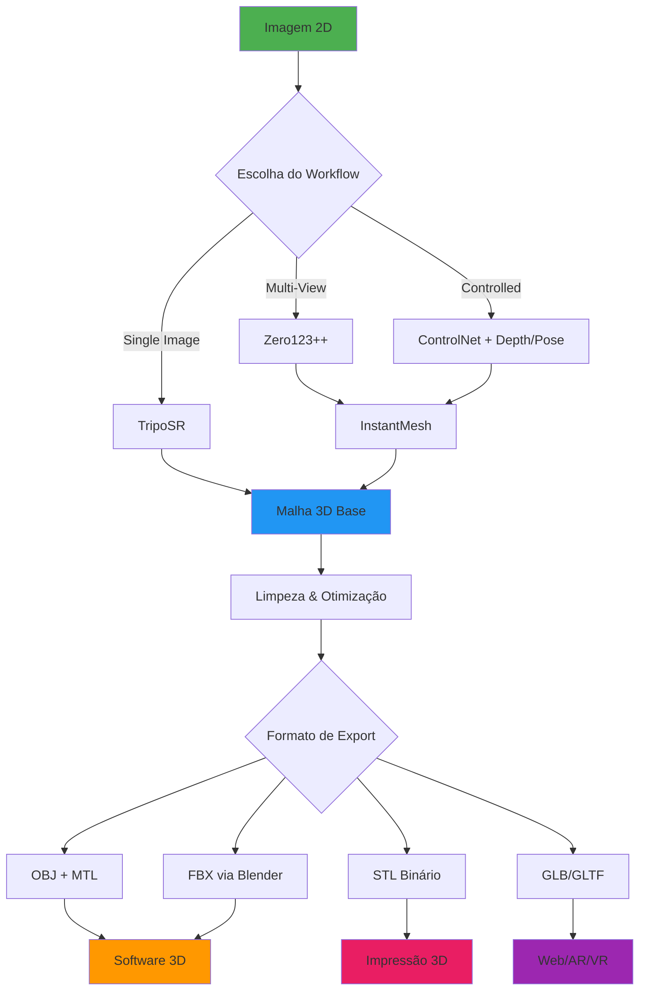
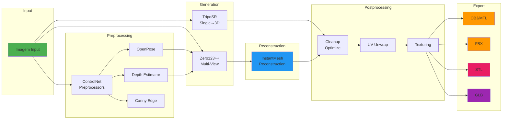

<div align="center">

# 🎨 AIEXX GenAI Image to 3D

### Pipeline Completo para Conversão de Imagens 2D em Malhas 3D

[](https://opensource.org/licenses/MIT)
[](https://www.python.org/downloads/)
[](https://github.com/comfyanonymous/ComfyUI)
[](https://huggingface.co/)
[](https://conventionalcommits.org)

---

**[Documentação](#documentação)** • **[Instalação](#instalação)** • **[Uso](#uso)** • **[Workflows](#workflows)** • **[Exportação](#exportação)** • **[Contribuindo](#contribuindo)**

</div>

---

## 📋 Índice

- [Sobre o Projeto](#sobre-o-projeto)
- [Tecnologias](#tecnologias)
- [Arquitetura](#arquitetura)
- [Requisitos](#requisitos)
- [Instalação](#instalação)
- [Configuração](#configuração)
- [Workflows Disponíveis](#workflows-disponíveis)
- [Formatos de Exportação](#formatos-de-exportação)
- [Compatibilidade de Software](#compatibilidade-de-software)
- [Estrutura do Projeto](#estrutura-do-projeto)
- [Contribuindo](#contribuindo)
- [Licença](#licença)

---

## 🎯 Sobre o Projeto

O **AIEXX GenAI Image to 3D** é um pipeline avançado baseado em **ComfyUI** que utiliza modelos de inteligência artificial de última geração para converter imagens 2D em malhas 3D completas e prontas para uso profissional.

### ✨ Principais Características

- 🔄 **4 Workflows Especializados** para diferentes casos de uso
- 🎨 **Múltiplos Modelos de IA**: Zero123++, TripoSR, InstantMesh, ControlNet
- 📦 **Exportação Multi-Formato**: OBJ, FBX, STL, GLB
- 🎯 **Controle Avançado**: Pose (OpenPose), Profundidade (Depth), Canny, Tile
- 🔧 **Pipeline Automatizado**: De imagem até malha finalizada
- 💼 **Produção Profissional**: Compatível com Maya, ZBrush, Blender, Element3D
- 🚀 **GPU Otimizado**: DirectML (AMD/Intel) e CUDA (NVIDIA)

---

## 🛠️ Tecnologias

### Modelos de IA

| Modelo | Função | Formato |
|--------|--------|---------|
| **Zero123 / Zero123++** | Geração de múltiplas vistas | `.safetensors`, `.ckpt`, `.pt`, `.pth` |
| **TripoSR** | Reconstrução 3D de imagem única | `.safetensors`, `.ckpt`, `.pt`, `.pth`, `.onnx` |
| **InstantMesh** | Reconstrução 3D multi-view | `.safetensors`, `.ckpt`, `.pt`, `.pth` |
| **ControlNet SD1.5** | Controle por pose/depth/canny/tile | `.safetensors`, `.pth` |

### Stack Tecnológico



### Pipeline de Processamento



---

## 📦 Requisitos

### Sistema Operacional
- ✅ **Windows 10/11** (testado e otimizado)
- ✅ **Linux** (compatível)
- ✅ **macOS** (compatível, sem DirectML)

### Hardware
- **GPU**: NVIDIA (CUDA), AMD (DirectML), Intel (DirectML)
- **RAM**: Mínimo 16GB, Recomendado 32GB+
- **Armazenamento**: ~50GB para modelos + exports

### Software
- **Python**: 3.11.x
- **Node.js**: 18.x ou superior (para Husky/commitlint)
- **Git**: 2.x ou superior
- **Blender**: 3.x ou superior (para exportação FBX)
- **ComfyUI**: Última versão estável

---

## 🚀 Instalação

### 1. Clone o Repositório

```bash
git clone https://github.com/AIExxplorer/AIEXX_GENAI_IMAGE_TO_3D.git
cd AIEXX_GENAI_IMAGE_TO_3D
```

### 2. Configure o Ambiente Python

```bash
# Criar ambiente virtual
python -m venv venv

# Ativar (Windows)
.\venv\Scripts\activate

# Ativar (Linux/macOS)
source venv/bin/activate

# Instalar dependências (quando disponível)
pip install -r requirements.txt
```

### 3. Instale Dependências Node.js

```bash
npm install
```

### 4. Configure o Husky

```bash
npm run prepare
```

---

## ⚙️ Configuração

### 1. Token Hugging Face

Configure a variável de ambiente com seu token:

**PowerShell (Windows):**
```powershell
# Temporário (sessão atual)
$env:HUGGING_FACE_HUB_TOKEN = "seu_token_aqui"

# Permanente (usuário)
[System.Environment]::SetEnvironmentVariable("HUGGING_FACE_HUB_TOKEN","seu_token_aqui","User")
```

**Bash (Linux/macOS):**
```bash
# Adicionar ao ~/.bashrc ou ~/.zshrc
export HUGGING_FACE_HUB_TOKEN="seu_token_aqui"
```

### 2. Download de Modelos

Execute o download dos modelos necessários:

#### ControlNet SD1.5
```bash
# Baixar para: ComfyUI/models/controlnet/
# Repositório: https://huggingface.co/lllyasviel/ControlNet-v1-1
```

Arquivos necessários:
- `control_v11f1p_sd15_depth.safetensors`
- `control_v11p_sd15_openpose.safetensors`
- `control_v11p_sd15_canny.safetensors`
- `control_v11f1e_sd15_tile.safetensors`

#### Zero123 / Zero123++
```bash
# Baixar para: ComfyUI/models/zero123/
# Coleções:
# - https://huggingface.co/collections/ashawkey/zero123-6566b613ab4a2a82a12f53c3
# - https://huggingface.co/collections/TencentARC/zero123-65fb3a9dbc3f5b4dcd8d55dd
```

#### TripoSR
```bash
# Baixar para: ComfyUI/models/triposr/
# Repositório: https://huggingface.co/stabilityai/TripoSR
```

#### InstantMesh
```bash
# Baixar para: ComfyUI/models/instantmesh/
# Repositório: https://huggingface.co/TencentARC/InstantMesh
```

### 3. Verificação

Confira se os modelos foram baixados corretamente:

```powershell
# Windows PowerShell
Get-Content "downloads_status.log" -Wait
```

```bash
# Linux/macOS
tail -f downloads_status.log
```

---

## 🔄 Workflows Disponíveis

### 1️⃣ Zero123 Multi-View Generation
**Arquivo:** `workflows/3d/01_zero123_multiview.json`

Gera múltiplas vistas de uma imagem única usando Zero123++.

**Input:**
- Imagem única (PNG, JPG)

**Output:**
- 8+ vistas da mesma cena

**Parâmetros:**
- Views: 8 (padrão)
- Seed: 12345
- Guidance: 3.5

---

### 2️⃣ Multi-View to Mesh (InstantMesh)
**Arquivo:** `workflows/3d/02_multiview_to_mesh_instantmesh.json`

Converte múltiplas vistas em malha 3D completa.

**Input:**
- Lista de imagens multi-view

**Output:**
- Malha 3D (OBJ, FBX, STL, GLB)

**Parâmetros:**
- Texture Resolution: 2048
- Clean Up: true

---

### 3️⃣ TripoSR Single Image to Mesh
**Arquivo:** `workflows/3d/03_triposr_single_image_to_mesh.json`

Reconstrução 3D direta de imagem única.

**Input:**
- Imagem única

**Output:**
- Malha 3D pronta

**Parâmetros:**
- Texture Resolution: 2048
- Scale Units: cm

---

### 4️⃣ Pose/Depth Guided Reconstruction
**Arquivo:** `workflows/3d/04_openpose_or_depth_guided_recon.json`

Reconstrução guiada por ControlNet (Pose ou Depth).

**Input:**
- Imagem + Control (OpenPose/Depth)

**Output:**
- Malha 3D guiada

**Parâmetros:**
- ControlNet: openpose / depth
- Guidance: 2.5

---

## 📤 Formatos de Exportação

### OBJ + MTL
- ✅ UV unwrapping
- ✅ Material definitions
- ✅ Compatível: Maya, ZBrush, Blender
- 📁 **Export:** `exports/obj/`

### FBX (via Blender)
- ✅ Smoothing groups
- ✅ Tangents
- ✅ FBX 2018/2019
- ✅ Compatível: Maya, 3ds Max, Element3D
- 📁 **Export:** `exports/fbx/`

**Uso:**
```bash
"<caminho_blender>\blender.exe" -b -P tools\blender_export_fbx.py -- "input.obj" "exports\fbx\output.fbx"
```

### STL
- ✅ Binário
- ✅ Watertight geometry
- ✅ Unidades: mm
- ✅ Compatível: Fatiadores 3D (Cura, PrusaSlicer)
- 📁 **Export:** `exports/stl/`

### GLB/GLTF
- ✅ Texturas embutidas
- ✅ PBR materials
- ✅ Draco compression (opcional)
- ✅ Compatível: Three.js, Unity, Unreal, Web AR/VR
- 📁 **Export:** `exports/glb/`

---

## 🎨 Compatibilidade de Software

| Software | OBJ | FBX | STL | GLB |
|----------|-----|-----|-----|-----|
| **Autodesk Maya** | ✅ | ✅ | ⚠️ | ⚠️ |
| **ZBrush** | ✅ | ✅ | ✅ | ❌ |
| **Blender** | ✅ | ✅ | ✅ | ✅ |
| **3ds Max** | ✅ | ✅ | ⚠️ | ⚠️ |
| **Cinema 4D** | ✅ | ✅ | ⚠️ | ⚠️ |
| **After Effects (Element3D)** | ✅ | ✅ | ❌ | ❌ |
| **Unity** | ✅ | ✅ | ❌ | ✅ |
| **Unreal Engine** | ✅ | ✅ | ❌ | ✅ |
| **Three.js / WebGL** | ✅ | ❌ | ❌ | ✅ |
| **Impressoras 3D** | ⚠️ | ❌ | ✅ | ⚠️ |

**Legenda:**
- ✅ Suporte completo
- ⚠️ Suporte parcial ou requer conversão
- ❌ Não suportado

---

## 📁 Estrutura do Projeto

```
AIEXX_GENAI_IMAGE_TO_3D/
│
├── ComfyUI/
│   ├── models/
│   │   ├── controlnet/          # Modelos ControlNet SD1.5
│   │   ├── zero123/             # Zero123 / Zero123++
│   │   ├── triposr/             # TripoSR
│   │   └── instantmesh/         # InstantMesh
│   ├── input/                   # Imagens de entrada
│   ├── output/                  # Outputs temporários
│   └── temp/                    # Arquivos temporários
│
├── workflows/
│   └── 3d/
│       ├── 01_zero123_multiview.json
│       ├── 02_multiview_to_mesh_instantmesh.json
│       ├── 03_triposr_single_image_to_mesh.json
│       ├── 04_openpose_or_depth_guided_recon.json
│       ├── 00_cleanup_optimize.README.txt
│       └── STATUS.txt           # Status de workflows
│
├── exports/
│   ├── obj/                     # Exportações OBJ + MTL
│   ├── fbx/                     # Exportações FBX
│   ├── stl/                     # Exportações STL
│   └── glb/                     # Exportações GLB/GLTF
│
├── tools/
│   └── blender_export_fbx.py    # Script conversão FBX
│
├── .husky/                      # Git hooks
│   └── commit-msg               # Validação Conventional Commits
│
├── .gitignore
├── commitlint.config.js
├── package.json
├── downloads_status.log         # Log de downloads
├── README.md
├── TODO.md                      # Tarefas pendentes
└── LICENSE

```

---

## 🤝 Contribuindo

Contribuições são bem-vindas! Seguimos o padrão **Conventional Commits**.

### Tipos de Commit

- `feat:` Nova funcionalidade
- `fix:` Correção de bug
- `docs:` Alterações na documentação
- `style:` Formatação de código
- `refactor:` Refatoração de código
- `perf:` Melhorias de performance
- `test:` Adição/correção de testes
- `build:` Mudanças em dependências
- `ci:` Mudanças em CI/CD
- `chore:` Outras mudanças

### Exemplo

```bash
git commit -m "feat: adiciona suporte para exportação USDZ"
git commit -m "fix: corrige orientação de normais no export FBX"
git commit -m "docs: atualiza README com novos workflows"
```

O **Husky** validará automaticamente seus commits antes do push! ✅

---

## 📊 Status do Projeto

Veja o arquivo **[TODO.md](TODO.md)** para uma lista completa de tarefas pendentes e em progresso.

---

## 📄 Licença

Este projeto está licenciado sob a **MIT License** - veja o arquivo [LICENSE](LICENSE) para detalhes.

---

## 🙏 Agradecimentos

- [ComfyUI](https://github.com/comfyanonymous/ComfyUI) - Framework base
- [Hugging Face](https://huggingface.co/) - Hospedagem de modelos
- [Stability AI](https://stability.ai/) - TripoSR
- [TencentARC](https://github.com/TencentARC) - InstantMesh, Zero123++
- [lllyasviel](https://github.com/lllyasviel) - ControlNet

---

<div align="center">

**Desenvolvido com ❤️ por AIEXX**

[⬆ Voltar ao topo](#-aiexx-genai-image-to-3d)

</div>

